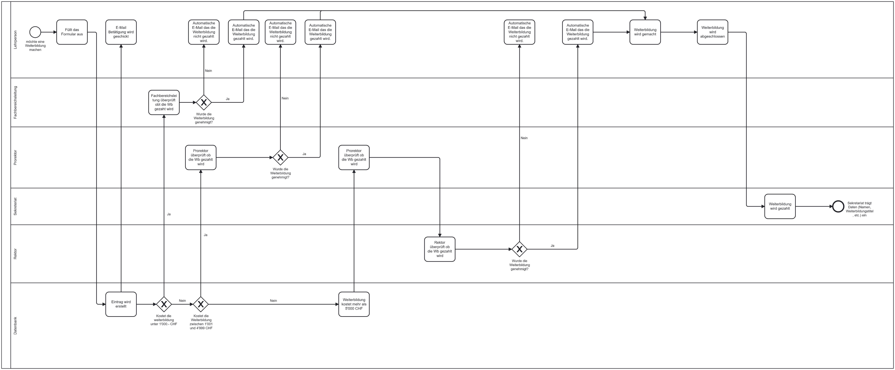

# Projektarbeit Modul 319: Applikationen entwerfen und implementieren

## Kurrzfassung
Meine Projektarbeit im Modul 319: Applikationen entwerfen und implementieren\
**Note : 5.0** (Dokumentation, Zeitplan, Präsentation, Prozesszeichnung)\
**Schule : [GBS St.Gallen](https://www.gbssg.ch/)**\
**Ort : Schweiz 🇨🇭**, Kanton Graubünden

## Einleitung
Programmierteil für Projektarbeit Weiterbildung im Modul 319: Applikationen entwerfen und implementieren\
Im Rahmen des Schulprojekts wurde ein Python-Skript entwickelt, das einen bestimmten Prozess zur Lösung eines schulischen Problems unterstützt. Ziel war es, mit Hilfe dieses Skripts den Ablauf zu automatisieren und die Effizienz des Prozesses zu steigern. Das Skript stellt ein praktisches Beispiel für den Einsatz von Programmiertools in schulischen Kontexten dar.\
Ich habe mich gegen eine Datenbank entschieden, da die Schule sowieso mit Excel arbeitet und diese Lösung mehr Vorteile mit sich bringt. Excel bietet eine benutzerfreundliche Oberfläche, die es ermöglicht, die Daten direkt zu bearbeiten und zu visualisieren, ohne dass zusätzliche Infrastruktur für eine Datenbank erforderlich ist. Zudem erleichtert es die Integration des Python-Skripts in den bestehenden Arbeitsablauf der Schule und sorgt für eine schnellere Umsetzung der Lösung.

## Flowchart


## Start des Projektes
Befehle für den Start des Projekts.\
1. Erstellung einer virtuellen Umgebung: 
```bash
python3 -m venv venv
```
2. Installation der Module in der virtuellen Umgebung
```bash
source venv/bin/activate && pip install -r requirements.txt
```
3. Starten des Webservers
```bash
uvicorn app:app --reload 
```

## Links und deren Funktion
### http://127.0.0.1:8000/ 
Diese URL öffnet das Antragsformular, das von der betreffenden Person ausgefüllt werden kann. Das Formular ermöglicht es, alle notwendigen Informationen für die Antragstellung zu hinterlegen.

### http://127.0.0.1:8000/admin
Diese Seite öffnet das Admin-Menü, über das Administratoren die Möglichkeit haben, neue Lehrer und Weiterbildungsangebote hinzuzufügen oder bestehende Einträge zu bearbeiten. Am unteren Ende der Seite befinden sich Links, die zu anderen relevanten Seiten weiterleiten, um eine effiziente Navigation zu gewährleisten.

### http://127.0.0.1:8000/admin/antraege
Diese Seite zeigt alle eingegangenen Anträge, die nach verschiedenen Bereichen strukturiert sind. Hier können die Anträge eingesehen, bearbeitet und verwaltet werden, um die notwendigen Anpassungen vorzunehmen oder weitere Schritte einzuleiten.

### http://127.0.0.1:8000/admin/statistik
Diese Seite bietet eine umfassende Übersicht über sämtliche Daten und Informationen. Die Administratoren haben hier die Möglichkeit, die Daten nach verschiedenen Kriterien zu filtern, um gezielte Auswertungen und Analysen durchzuführen.

